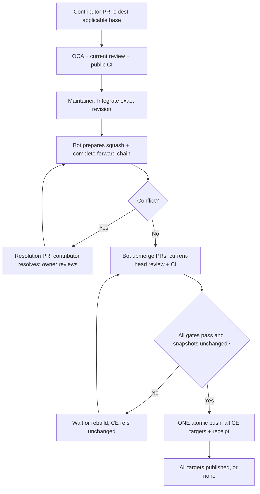
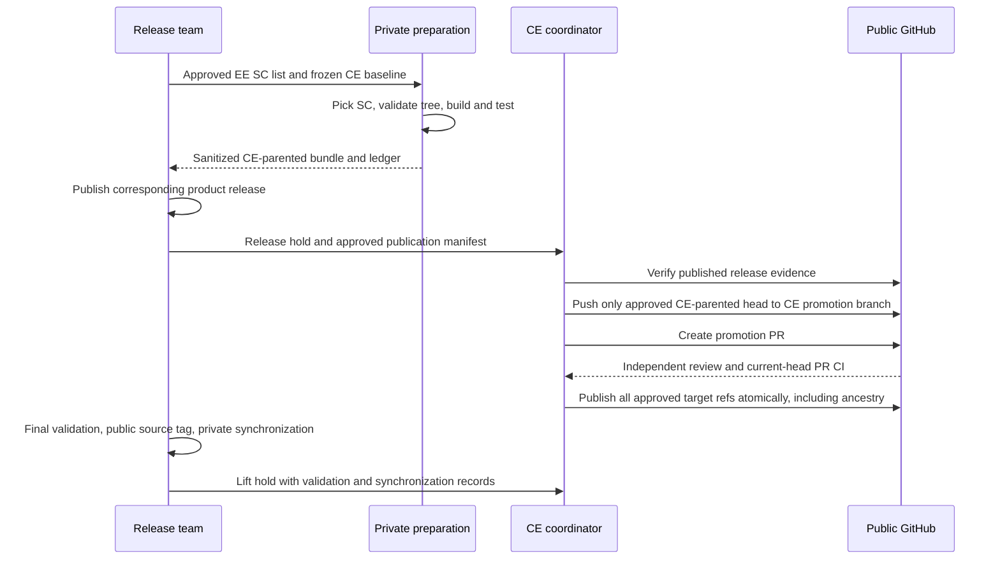

# CE forward integration: contributor guide and operator runbook

Option A is implemented: start at the oldest applicable supported branch and
propagate toward Innovation. **All affected CE branch refs and an integration
receipt publish in one `git push --atomic`. There is no SQLite database.**
The checked-in configuration is **shadow mode**, with only `trunk` configured;
production LTS names, ownership, and App IDs still require
an administrator's inventory and non-production rehearsal.

## What the contributor and bot do

The PR's GitHub **base** dropdown selects the starting branch. `Upmerge-Till`
selects the last branch that needs the content, not the original PR target.
For example, if the deployed chain is `8.4 → 9.7 → trunk`, a fix needed in all
three starts with a PR whose base is `8.4`. The source branch can be in a personal
fork or, for contributors with push access, in the CE repository. Both follow
the same OCA, review, content, CI, and authorization gates. The contributor does
not first merge into `trunk`. These version names are illustrative only.

1. Contributor opens the original PR against the oldest applicable branch.
2. Trusted OCA verification, public CI, resolved conversations, and
   current-head approval from a reviewer with the repository Write, Maintain, or Admin
   role (including collaborators on personal repositories) make it eligible. CODEOWNERS is not an integration gate.
   Target advancement alone does not require a contributor rebase: existing CI
   remains valid for the unchanged PR head if it tested an ancestor of the current
   target and the changes still merge cleanly. No extra validation PR is opened.
3. An authorized maintainer clicks **Integrate** on the App's `Merge check` check.
   Authorization binds the PR head, target, and body. The label is advisory.
4. The App snapshots the chain and prepares the original squash commit and every
   forward merge commit. Nothing has merged into any CE target yet.
5. The App stages candidates under `upmerge/` in the CE repository and opens an upmerge PR for
   each newer branch. Reviewers approve those exact candidates, including null
   merges. CI validates each reviewed PR head; the App checks its clean merge
   against the current target before publication.
6. After every target passes, the App rechecks authorization, reviews, checks,
   branch snapshots, release holds, and deployment policy. One atomic push updates
   all affected CE refs and creates an immutable receipt.
7. `CE / operation` reports the PRs, resulting SHAs, and receipt. Downstream SEC/EE
   synchronization follows independently from a recorded completed CE snapshot.



For ordinary forward propagation, omit `Upmerge-Till` (defaults to Innovation),
or put an uncommented line in the PR body:

```text
Upmerge-Till: trunk
```

An earlier content stop needs an explicit explanation, for example:

```text
Upmerge-Till: 8.4
Upmerge-Reason: The affected subsystem was removed from all newer supported branches.
```

That example still prepares and reviews ancestry-only merges into `9.7` and
`trunk`. Each keeps its target tree unchanged while retaining its lower branch as
an ancestor. A conflict is never treated as evidence that a fix is unnecessary.
The App ignores HTML-commented template examples and rejects backward targets,
empty/duplicate targets, and backport metadata. Every generated PR is reviewed;
the source PR's OCA eligibility carries forward. A contributor-supplied resolution
PR also needs trusted OCA verification.

Original contributions squash, retaining the source head's author and co-author
trailers for the introduced commits. Forward upmerges use merge commits. Security
promotion retains the individually approved SC commits. Rebase merging is disabled.
Because publication uses Git directly, GitHub PR UI updates are not transactional:
a squash-integrated original PR is closed with a successful `CE / operation`
check and receipt, rather than promising GitHub's native “Merged” flag. Upmerge
PR heads become reachable and GitHub can recognize those as merged. Notifications
and PR closure retry independently and cannot change a successful Git transaction.

## Atomicity, persistence, and enforcement

Git's [atomic push](https://git-scm.com/docs/git-push#Documentation/git-push.txt---atomic)
updates all requested refs or rejects all of them; unsupported servers fail closed.
Every target uses an exact expected-old-SHA lease and must advance by ancestry.
The App never falls back to sequential merge API calls or individual pushes.
The receipt tag `ce-integration/<operation-id>` is created in the same transaction.
This guarantee covers refs in the CE repository, not review events, PR UI changes,
temporary staging refs, or separate SEC and EE repositories.

A single service host uses a process-scoped `flock` to exclude concurrent workers.
There is no durable merge-lock owner or timeout-based unlock. Local JSON manifests
retain the authorized revision, prepared SHAs, generated PRs, CI source revision, and
publication intent; Git bundles preserve prepared objects across restarts. These
are fsynced on persistent local disk, with append-only JSONL audit events. They
are needed to resume the exact approved batch, not to simulate multi-branch
atomicity. Do not put the journal on NFS, ephemeral Actions storage, or independent
replicas. Back up the journal and bundles together with the service stopped;
export audit events to access-controlled append-only storage. The local files
are not tamperproof against the service/filesystem administrator.

`rulesets` generates administrator-reviewed controls:

| Control | Enforcement |
| --- | --- |
| CE updates | Only the merge App may update configured CE target branch refs |
| PR review | Required PR, one Write/Maintain/Admin approval enforced by the App, stale-review dismissal, last-push approval, resolved threads |
| App exception | The App bypasses the native PR-only update rule solely to publish the reviewed batch via Git; its code enforces the PR review checks |
| Required checks | `Merge check`, bound to this App, with **no bypass** |
| History/lifecycle | No force updates, deletion, or routine creation of configured CE target branches; no linear-history rule |
| Tags | Immutable; only the merge App creates receipts, separate release App creates release tags |

Branch rules cover the configured development-chain and release targets. Other
contributor branches in the CE repository can be created and updated according
to normal repository permissions and any additional organization rules.

Bot staging defaults to the CE repository and reuses its existing App installation.
No second GitHub account, repository, or installation is required. The generated
**CE bot staging** ruleset reserves `upmerge/` and `promotion/` branch namespaces
for the App. These temporary refs are separate from the configured CE target refs:
staging does not merge a change into any maintained branch. GitHub's
[recursive ruleset patterns](https://docs.github.com/en/repositories/configuring-branches-and-merges-in-your-repository/managing-rulesets/creating-rulesets-for-a-repository#using-fnmatch-syntax)
cover nested operation names. Target quality checks retain no bypass, and only
the configured App can bypass staging creation/update/deletion restrictions.
Targets cannot be configured inside these reserved namespaces.

Omit the legacy `bot_fork` and `fork_installation_id` fields for this default.
Existing deployments that explicitly configure a different `bot_fork` remain
supported and require that fork's installation ID. If `bot_fork` equals
`repository`, the main installation is always reused. Apply the generated
staging ruleset before activating the updated service. Changing staging policy
requires aborting/re-authorizing unpublished work; reconcile uncertain publication
before changing it.

Security promotion uses `promotion/` branches in the same repository. Approved
SC manifests, independent release/security authorization, validated source trees,
and the requirement for an already public release remain mandatory before any
public staging write. No SEC/EE history is merged into CE.

An App direct push is therefore part of this design. A requirement that even the
App may only use GitHub's single-PR merge endpoint would conflict with atomic
multi-branch publication. The App has read-only administration permission and
cannot alter its rulesets. Rehearse the combined native checks and narrowly scoped
PR-rule bypass on GitHub before activation. Existing organization rules can impose
additional restrictions; any rejection leaves the whole transaction unpublished.

The App checks every introduced commit's paths and metadata, not just the final
diff. Populate the actual EE/Cloud/private path denylist during inventory; the
checked-in `internal` and `internal-sec` entries are only the starting policy.
Human review remains necessary for confidential content not identifiable by paths.
Security work must remain private until authorized release, including forks/logs.

Every MTR shard checks that its configured suites exist in the candidate's public
source before installing the toolchain or building. CE validation uses the same
public suite lists as the ordinary MTR workflow. Missing suites fail explicitly;
no missing suite is silently skipped.

The bot does not exclude a review because its author also authored the PR. GitHub
itself prevents authors from submitting an Approve review on their own PR; removing
the bot's redundant check does not enable that native action or add a bot approval
action. Existing native review protections still apply.

## Install and cut over

Prerequisites: Python 3.10+, Git 2.38+ with `merge-tree --write-tree`, OpenSSL,
persistent local disk, outbound GitHub HTTPS, and TLS webhook ingress. The Python
service has no third-party dependencies. Never run contributor code on this host.

1. Inventory the production branch chain and repository reviewer roles. Keep existing public
   history and reconcile lower-to-higher ancestry through reviewed baseline work.
   Initialize SEC from CE and reconcile EE's CE baseline without replacing its
   tree. Routine sync refuses unrelated histories and does not resolve conflicts
   with automatic ours/theirs strategies.
2. Register the GitHub App from `.github/ce-merge-app.json` with the actual webhook
   URL. Install on public CE; ordinary staging reuses this installation. The
   generated staging ruleset restricts bot branch writes to this App.
   `workflows: write` allows reviewed workflow changes to integrate; the App has
   no SEC/EE access. Use separate private and
   release credentials. Require organization 2FA for members/collaborators.
3. Copy `.github/ce-merge-policy.json` to `/etc/mysql-ce-merge/policy.json`. Set real
   repository name, ordered branches (Innovation last), release branches,
   maintainers, App/installation IDs, and public-content policy. Keep `strategy`
   set to `forward`. `release_app_id: 0` (or omitted) permits ordinary merge
   activation while blocking creation of all non-receipt tags. Configure the
   separate release App and update its tag ruleset before creating release tags;
   the merge App receives no release-tag bypass. Reviewers need the repository Write, Maintain, or Admin role.
   Collaborators on personal repositories qualify with Write access. Approval does not require membership
   in the configured `maintainers` allowlist, which controls integration requests
   and trusted OCA verification. CODEOWNERS may still be used for review routing.
4. Install the existing PR Build, MTR, and Format Check workflows on each
   configured branch. The coordinator reads their results; it never dispatches
   CI. Verify the build/test scripts against every supported branch. Legacy
   `ci_ref` and `ci_revision` settings are ignored and can be removed.
5. Supply `CE_APP_PRIVATE_KEY` (PEM path) and `CE_WEBHOOK_SECRET` (32+ random
   characters) outside the checkout. The CLI defaults to a persistent public Git
   cache at `<state-dir>/public.git` and logs its location when starting `serve`
   or `once`. The first fetch may take several minutes; later evaluations reuse
   the downloaded objects. Set `CE_GIT_CACHE` to override this with an absolute
   path to a dedicated private directory containing only public CE Git objects.
   An unset or empty value uses the default. Do not share a cache across separate
   coordinator state directories or repositories. The packaged service explicitly
   uses `/var/lib/mysql-ce-merge/public.git`.
   Fetches allow 3,600 seconds by default. Set `CE_GIT_FETCH_TIMEOUT` to a positive
   number of seconds for a slower initial download. Other Git commands retain
   their 600-second timeout. Fetch start, completion, and timeout are logged;
   a timeout or interruption terminates Git and its helper processes. Only
   completed fetches provide reusable packs; an interrupted initial download
   may need to restart even when a cache is configured.
   Successful public fetches retain their source tips under local `refs/ce-cache/`
   references so subsequent fetches can negotiate from cached history. These
   references are never included in the explicit publication refspecs. An older
   cache containing objects but no references may need a one-time reference to a
   known public commit already in that cache, or one successful fetch with this
   version, before incremental downloads take effect. Do not delete the cache.
6. Generate ruleset payloads and apply them as an administrator in rehearsal.
   Provision branches before enabling lifecycle protection. Validate existing
   bypasses and native checks; create the advisory `Integrate` label. GitHub hides
   `bypass_actors` from an App with read-only administration access. An administrator
   must export each full repository ruleset using administrator credentials into
   a local JSON file shaped as `{"repository": "owner/repo", "rulesets": [...]}`.
   Include each ruleset's `id`, `updated_at`, `source`, `source_type`, conditions,
   rules, and full bypass list from `GET /repos/owner/repo/rulesets/{id}`.
   Run `attest-deployment /path/to/snapshot.json` with the intended active policy
   and the service's state directory. Only use a trusted administrator export;
   this local command is an operator action, never a PR-supplied input. It checks
   the live rules, records the snapshot with a policy fingerprint, and audits the
   change. Runtime verification compares live ruleset identity and revision before
   using its hidden bypass list; any ruleset edit or policy change requires fresh
   attestation. The App keeps read-only administration permissions. See the
   [GitHub ruleset API visibility contract](https://docs.github.com/en/rest/repos/rules#get-a-repository-ruleset).
   Shadow mode
   reads existing PR CI and reports readiness but never authorizes, stages, or publishes merges.
   If a previously evaluated PR targets a branch removed from this deployment,
   its old readiness result is superseded by a neutral `Merge check` explaining
   that the target is outside scope. This grants no integration authorization.
7. Complete the acceptance rehearsal below. Drain/reconcile Gerrit CE work,
   disable the old public import/export writer, activate the reviewed settings,
   set `mode: active`, and set repository variable `CE_MERGE_MODE=active` to retire
   the scheduled advisory labeler. Do not run both publication paths as writers.

```sh
python3 -W error::ResourceWarning -m unittest discover -s scripts/ce_merge/tests -v
python3 -m scripts.ce_merge --policy /etc/mysql-ce-merge/policy.json rulesets
python3 -m scripts.ce_merge --policy /etc/mysql-ce-merge/policy.json verify-deployment
python3 -m scripts.ce_merge --policy /etc/mysql-ce-merge/policy.json --state-dir /var/lib/mysql-ce-merge/journal serve
```

Install `scripts/ce_merge/deploy/mysql-ce-merge.service` only after provisioning
its service user, checkout, credentials, and state directory. Webhooks listen on
loopback `/webhook`; terminate TLS and enforce request/concurrency limits at the
ingress. HMAC, App/installation identity, current maintainer permission, and action
identity checks protect authorization. Duplicate deliveries reuse the operation.

### CI contract

The App publishes one **Merge check**, which reports readiness and offers
**Integrate** in active mode. It reads the existing PR Build, MTR, and applicable
Format Check workflows; there is no CE Merge Validation workflow or App-triggered
CI dispatch. Rerun failed jobs through GitHub Actions when needed.

Acceptance requires a successful run for the **current PR head** from each
required repository workflow and every required job/step, including both compiler
builds, all four MTR shards, and services unit tests. Format Check is required for
C/C++ and `.clang-format` changes. The App does not infer success from labels or
accept its own summary as CI evidence. Changed CI workflow files require a
reviewed bootstrap update before their results can be trusted.

Each PR workflow records `pr:<number>:<base>:<head>:<merge>` in its run title.
The recorded PR number and head must match the open PR; the recorded target base
must be an ancestor of the current target. Passing merge-verification steps attest
the combination actually tested. Existing older runs can be reused only when
GitHub supplies a complete matching PR/head/repository association and an accepted
target ancestor. Empty fork metadata, checks on an older contributor revision,
or unrelated target history cannot authorize integration. Successful sibling
jobs from earlier attempts of the same run can be reused when failed jobs are
rerun. Newer pending/failed runs supersede old successes.

**Accepted tradeoff:** the target can advance after CI runs. The coordinator
computes the merge against the latest target locally and rejects conflicts, but
does not require CI to have tested that latest combined tree. A clean Git merge
does not prove that the combination is free of build or behavioral regressions.
This policy deliberately accepts that risk to avoid mandatory rebases or repeat
CI solely because the target advances. Targeting a branch does not automatically
rebase the contributor's commits. The bot leaves those commits and their approvals
unchanged; source changes still require fresh checks and current-head approval.

The coordinator uses no extra validation PR, validation branch, workflow dispatch,
or automatic CI rerun. GitHub's temporary test-merge ref may be stale or absent:
current mergeability is computed from the current target and source objects.
For a prepared squash/upmerge, the App checks the prepared parents and equality
with the current clean merge of its reviewed source PR. It rechecks source
reviews, OCA, CI, and target snapshots before the atomic push. The normal forward
upmerge PRs still provide their required reviews and existing PR CI.

If a target moves while an ordinary unpublished batch waits, the App retains
source-head authorization, archives the old candidate mapping, and rebuilds the
chain. Changed upmerge PR heads need fresh reviews and CI. Promotions and accepted
conflict resolutions require explicitly reviewed replacements if their recorded
target moves. Once publication intent exists, only receipt reconciliation/retry
is allowed; a possibly published transaction is never automatically rebuilt.

Only `Docs/**`, `README`, `README.md`, and `CONTRIBUTING.md` qualify for an explicit
documentation-only exemption. Other Markdown files are covered by PR CI. Missing,
skipped, foreign, or superseded-head evidence never passes. Active deployments must replace
the two legacy required check contexts with **Merge check**, still bound to the
App; the deployment verifier blocks until the rulesets match. Historical checks
are left intact, but only the new check name can authorize integration.

## Conflict resolution and recovery

`status` and `CE / operation` show the batch state and candidate/PR mapping.
Monitor blocked/conflict/uncertain states, CI age, pending reviews, and private
sync age. A long review wait leaves CE refs unchanged.

```mermaid
stateDiagram-v2
    [*] --> queued: maintainer authorizes
    queued --> prepared: snapshot and prepare
    prepared --> conflict: upmerge needs resolution
    conflict --> prepared: reviewed resolution PR
    prepared --> blocked: changed authorization or policy
    prepared --> publishing: all gates pass; save exact intent
    publishing --> complete: atomic receipt confirmed
    publishing --> uncertain: lost response or rejected push
    uncertain --> complete: reconcile receipt
    uncertain --> publishing: explicit retry of same transaction
    blocked --> aborted: cancel unpublished batch
```



For a conflict, the bot stages the lower candidate under `upmerge/` in CE and opens a PR
against the conflicting target. The check lists the exact lower candidate and
base SHAs. In your own fork, fetch that bot branch, start a resolution branch from
the recorded target base, merge the lower candidate, resolve conflicts, and commit.
Open a resolution PR against that target. Do not squash away either parent.
After OCA and current-head approval from a reviewer with Write, Maintain, or Admin access, the merge captain runs:

```sh
python3 -m scripts.ce_merge repair-upmerge OPERATION_ID --pr RESOLUTION_PR
```

The App requires both exact inputs in the resolution ancestry, rescans content,
freezes its head/body, rebuilds the remaining chain, and runs CI on the resolved
candidate. Another conflict repeats this process. Earlier unchanged candidates
retain their reviews; changed higher candidates need new PRs/reviews. Resolution
cannot turn an approved null merge into a content change. The original PR's own
conflict must be fixed in that PR and newly authorized. Security promotion conflicts
require freshly approved release manifests, not the ordinary repair command.

Use deployed `--policy` and `--state-dir` arguments before each subcommand:

```sh
python3 -m scripts.ce_merge status
python3 -m scripts.ce_merge audit
python3 -m scripts.ce_merge resume OPERATION_ID
python3 -m scripts.ce_merge abort OPERATION_ID
python3 -m scripts.ce_merge reconcile OPERATION_ID
python3 -m scripts.ce_merge retry OPERATION_ID
python3 -m scripts.ce_merge resolve-rejected OPERATION_ID --fencing-record RECORD
```

`resume` rechecks unpublished work. Ordinary target movement automatically
rebuilds the batch while retaining source-head authorization. If the source
revision/body or policy changes, abort and obtain fresh Integrate authorization.
Promotion and reviewed-resolution target changes require a reviewed replacement.
Superseded upmerge PRs must not be merged manually.
Abort creates no CE changes and clears cached eligibility so a fresh action can
be offered. Completed and uncertain operations cannot be aborted.

An uncertain response is never interpreted as failure solely because of time.
First reconcile the immutable receipt. If present with its expected object ID,
publication succeeded. Otherwise `retry` revalidates and sends the **same entire
transaction**, using the same receipt and old-SHA leases. Before abandoning an
unconfirmed attempt, stop/fence the old process and credentials, confirm no receipt
and all original target heads, then use `resolve-rejected` with evidence. Never
force-push, delete published history, or delete journal files to unlock a batch.
PR reporting errors retry independently after receipt confirmation.

## Daily private integration

Capture a completed CE snapshot with `python3 -m scripts.ce_merge snapshot` using
the deployed policy and state-directory arguments. The command takes the worker exclusion
lock and refuses an uncertain publication or release hold. Prepared work has not changed any CE branch. Schedule this from
the existing private scheduler once daily, with merge-captain-approved urgent runs.

On a separate private host, create an operation specification. Source and target
repositories are absolute paths to trusted local clones. `source_sha` values come
from the recorded CE snapshot, and `before` values are approved downstream heads.
Branches must be ordered oldest to newest. For example:

```json
{
  "kind": "ce-sync",
  "source": "/private/clones/ce",
  "targets": [{
    "repository": "/private/clones/sec",
    "push_url": "PRIVATE_SEC_REMOTE",
    "branches": [{"name": "trunk", "before": "TARGET_SHA", "source_sha": "CE_SHA"}],
    "validate": [["/private/bin/validate-sec"]]
  }]
}
```

Include EE as a second target for independent CE-to-EE merging. The runner stages
explicit non-fast-forward merges, upmerges each lower result into the next branch,
and runs the configured validation commands. Conflicts retain the workspace and
fail; no automatic ours/theirs strategy is used. Remote publication uses normal
fast-forward, atomic multi-ref pushes per target repository. Cross-repository
publication is not atomic; the retained intent and resulting SHAs allow retries
to skip a target that already received its results.

```sh
python3 -m scripts.ce_merge.private /private/sync.json --state-dir /private/sync-journal
python3 -m scripts.ce_merge.private /private/sync.json --state-dir /private/sync-journal --apply
```

The first command stages and validates; it does not push. Repeating the exact
specification reuses its durable prepared result. A failed preparation leaves a
workspace for investigation: archive it before a new attempt. A moved remote head
requires fresh snapshots and a new specification. Private validation logs and
ledgers must not be uploaded to public Actions or public issue comments.

For SEC-to-EE delivery, use `kind: security-pick` with SEC as `source`, EE as the
target, and `picks: [{"kind":"SC","sha":"...","item":"..."},
{"kind":"ST","sha":"...","item":"..."}]` on each target. SC changes must
exclude private paths; ST changes must be confined to `internal-sec/`. Each pick
produces its own `-x` commit and source/result ledger entry. The release ledger
selects only undelivered items; empty or conflicting picks stop for reconciliation.

## Release-time security promotion

Before release, use `kind: prepare-promotion`, EE as the source, and a clean CE
baseline clone as the target. Select only SC picks; provide independent
`security_approval` and `release_approval` records. Each target branch also needs
`expected_public_tree`, the tree SHA of the privately validated, filtered CE
release source. Configured validation commands must build/test that CE source and
verify its release equivalence. Development and release targets are separate when
their baselines differ.

Preparation cannot push. It creates an approved-SC bundle with the CE baseline as
a prerequisite and a private ledger. The working clone contains private objects:
**never copy or push that clone to a public fork**. Transfer only the approved
bundle and publication manifest through the authorized release process.



The implemented release-evidence adapter requires a **published GitHub Release**
in the configured CE repository with a matching `release_id` and `release_tag`.
For product releases announced elsewhere, the release team must publish the
corresponding GitHub release evidence after actual product release, or implement
and rehearse an equivalent authenticated adapter before enabling promotion.
Do not use an approval timestamp or a draft release as publication evidence.

Declare every target on the hold with repeated `--target` arguments. Development
targets must include every successor through Innovation. Register one manifest
per target. Higher development targets need an `ancestry_reason` explaining why
their independently prepared SC tree supersedes lower content. The generated PR
retains that tree and the lower candidate as an additional parent; review is
mandatory. No target publishes until all manifests, reviews, and CI are complete.
The prepared steps freeze the batch's target set. The coordinator revalidates that
set against the release hold before advancing, immediately before publication,
and on retries. Changing hold targets invalidates the prepared batch: abort the
unpublished operation, register the manifests for the revised target set, and
authorize a new batch. A hold reason change does not invalidate the batch.

If validation or a conflict requires rebuilding a promotion, abort any unpublished
operation for that release first, then run `publish-promotion` with the replacement
manifest (or `register-promotion` for an existing open replacement PR). Registration
selects one active manifest per release and target. Previous PR manifests and audit
events remain recorded, but superseded PRs cannot authorize or enter a new batch.
Closing a PR alone does not change the selected manifest. Reauthorize the batch
from its active oldest-target PR after replacement. Uncertain publication must be
reconciled first, and a completed release cannot be replaced.

When removing a target, abort all unpublished operations for the release, change
the hold to the revised target list, and explicitly retire each removed target:

```sh
python3 -m scripts.ce_merge retire-promotion --release-tag PRODUCT_RELEASE_TAG --target REMOVED_BRANCH --reason 'Release owner approved reduced scope'
```

Retirement preserves the PR manifests and audit history. A persistent retirement
record prevents old manifests from reappearing after restart; the retired PR cannot
enter a batch. Retirement is rejected while release operations are non-aborted,
publication is uncertain, or the target remains in the hold. Register any required
replacement manifests, then authorize a new batch from the oldest active target.

For journals created before active-manifest tracking, an unambiguous manifest per
target remains usable. If a target already has several historical entries, register
the approved replacement explicitly; the coordinator will not guess which one wins.

Publication manifest fields:

```json
{
  "release_id": 123, "release_tag": "PRODUCT_RELEASE_TAG",
  "base": "trunk", "base_sha": "CE_BASE_SHA", "head": "PREPARED_CE_HEAD",
  "commits": ["FIRST_CE_PICK_SHA", "LAST_CE_PICK_SHA"],
  "expected_tree": "VALIDATED_PUBLIC_TREE_SHA",
  "bundle": "/private/approved-sc.bundle", "bundle_ref": "refs/heads/ce-promotion-0",
  "security_approval": "SECURITY_SIGNOFF_RECORD",
  "release_approval": "RELEASE_SIGNOFF_RECORD",
  "validation_record": "PRIVATE_VALIDATION_RECORD"
}
```

Only trusted release operators with service-account access may import manifests;
the signoff fields reference existing private approval records, not self-service
claims from contributors. Keep manifests and the coordinator journal private.

```sh
python3 -m scripts.ce_merge hold --reason 'Released security promotion' --release-tag PRODUCT_RELEASE_TAG --target trunk
python3 -m scripts.ce_merge publish-promotion /private/publication.json
# Repeat publication for EVERY declared target; review each source PR.
# Authorize Integrate on the oldest target, then review all generated candidates.
python3 -m scripts.ce_merge unhold --validation-record RECORD --sync-record RECORD
```

Use deployed policy and state-directory arguments on these commands. Publication
checks actual release evidence before the first public write, verifies the complete bundle
ancestry and tree, and pushes only the approved head. It registers the resulting
PR against its exact head. `register-promotion` supports an already-created,
authorized PR using the same manifest plus `pr`, with the same release gate.
Both paths require `expected_tree` and verify that the approved head's tree matches
it, along with the approved commit list and ancestry. The coordinator repeats this
validation when evaluating, preparing, publishing, or retrying a promotion; CI cannot substitute for
validated release-source equivalence. Legacy manifests missing `expected_tree`
must be replaced with an approved manifest before proceeding.

After promotion, the release pipeline validates the final CE source and uses its
separate release App to create the annotated public source tag at the recorded
release revision, never at an arbitrary development tip. The tag must be distinct
from any preexisting announcement tag if its source revision differs; never move
an existing tag. Run CE-to-SEC and CE-to-EE reconciliation privately before lifting
the hold. `unhold` requires operator evidence references, the complete declared
promotion batch published, and complete development-branch ancestry. Existing release validation,
tag publication, private scheduling, and organizational signoff systems remain
external integration points; their success must not be inferred from a PR merge.


## Acceptance before production activation

The ordinary PR CI reporter intentionally withholds trusted status when a PR edits
the workflow that produced a result. Builds and tests can succeed while their
reported status says `PR edits this workflow; result is not trusted`. The reporter
change itself takes effect only after it reaches the trusted default branch.
Review bootstrap workflow changes and their run logs explicitly; rerunning an
unchanged PR does not remove this restriction. CE validation remains a separate
workflow at the configured trusted ref and still requires deployment and configuration.

Local tests exercise real disposable Git repositories plus a simulated GitHub API.
They do not establish that production GitHub rulesets, reviews, credentials, or
MySQL builds are configured correctly. Demonstrate these in non-production GitHub:

- Original PRs from both forks and same-repository branches, plus all generated
  upmerges, are reviewed; all CE refs publish
  together and preserve each lower branch's ancestry in its successors.
- Missing OCA, stale approval/head, unauthorized action, unresolved threads,
  failed/skipped CI, forbidden commit history, and policy drift block publication.
- Humans cannot push/merge into configured CE targets; App pushes missing either trusted check fail; valid
  atomic App publication succeeds; force pushes and tag changes are rejected.
- Reject one target or the receipt and observe no requested ref changes. Competing
  publishers cannot replace snapshots. An unsupported atomic server fails closed.
- Conflict resolution, reviewed null merges, crashes, duplicate events, and lost
  responses recover without partial publication or duplicate integration.
- GitHub accepts ancestry-only PRs and updates PR UI as expected; squash closure
  and receipt links clearly identify the integrated result.
- Run trusted CI on every actual LTS branch; no missing suites or quarantine gaps.
- CE ancestry is reachable in both SEC and EE; SC/ST stay separate; only approved
  SC becomes public after the real release, with validated release-source tags.
- Verify CE bisect and EE first-parent bisect on the rehearsal history.

Daily scheduling, organizational 2FA, release signoff systems, final source tag
publication, and live repository administration remain deployment responsibilities.
To pause rollout, disable new integration requests, stop the executor safely, and
reconcile any publication intent. Preserve all already-published history.

## Temporary single-test MTR rehearsal

Set repository Actions variable `CE_MTR_TEST=main.1st` to have the existing MTR
workflow execute that real test in each shard. Set `"ci_mtr_test": "main.1st"`
in the local App policy to explicitly accept that limited coverage, then restart
the coordinator. The variable controls execution; the policy controls acceptance.
Neither launches an additional workflow. Builds and unit tests still run.

The selected test must exist in the candidate. Rehearsal failures remain failures.
`Merge check` labels limited results as REHEARSAL. The regular CI reporter uses a
separate `MTR rehearsal` status, leaves full `MTR` coverage pending, and clears
full-suite labels. Mixed test selections or full/rehearsal shards cannot pass.
The helper is taken from the trusted base checkout. Existing running workflows
keep their old behavior; updating the policy cannot alter a running job.

After rehearsal, delete repository variable `CE_MTR_TEST`, remove `ci_mtr_test`
from the local policy, restart, and obtain fresh full-suite PR CI. Reconcile any
uncertain publication and abort/rebuild unpublished prepared batches before
changing deployment policy. Rehearsal results do not qualify a release.
